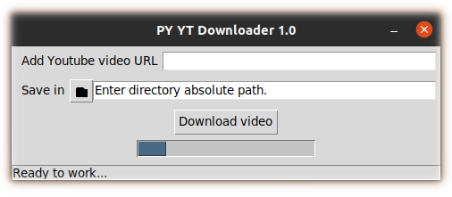

# Python Youtube video downloader

*Powered by Pytube.*

A TKinter application to download Youtube videos.



## Rationale

Pytube already has a CLI, but non-technical end-users can find the syntax hard. This application wraps Pytube with TKinter in a *very* simple, yet effective, application.

## Building and running

This repo contains the source code in Python for this project, along with the config files for building this project.

### Requirements

You need Python 3.6 or higher.

### Building using PIP and running

1. Open the terminal and navigate to this project's root folder.

1.  
    ```
    python3 -m venv .venv
    ```

    - In Windows and MacOS, you might need to run `python` from the command line or terminal.

1. Choose:

    - In Linux, do `source .venv/bin/activate`
    - In Windows, navigate to the `Scripts` folder and run `Activate.ps1`.
    - In MacOS, do `source .venv/bin/activate`


1. In the root folder of this project:  

    ```
    pip install -r requirements.txt
    ```

    - This installs the required packages.

1. Run using:

    ```
    python3 yt_downloader.py
    ```

    - Or make sure you run using Python 3 with any other method.

### Building using setuptools

This repo contains the files necessary to build this project using `setuptools`. Refer to [their documentation](https://setuptools.pypa.io/en/latest/index.html) for details on building.

### Building an .exe file

You can use a Python package such as `Pyinstaller` to generate an `.exe` file for Windows or an executable for other OSs for that matter, if you want to. Refer to [their documentation](https://www.pyinstaller.org/) for details.

## Application usage

Choose the directory where you want to save the video, paste the URL and download.

## License

This project is licensed under the [MIT License](LICENSE).

